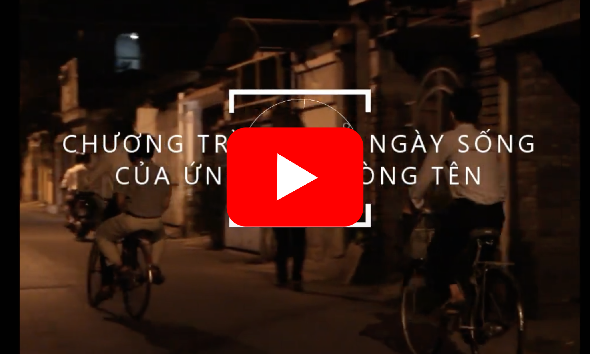

*Tôi được sinh ra để sống cho những gì cao quý hơn". Thánh Stanislao Kostka*

🔥Đã bao giờ bạn sống ở 1 nơi hoàn toàn mới?

🔥Đã bao giờ bạn nghĩ rằng mình sẽ gia nhập 1 hội dòng không ?

## Nạp năng lượng

<Figure :src="nnl" caption="Nạp năng lượng." />

Khi bắt đầu năm học bạn sẽ được nhà Ứng sinh tổ chức những ngày để tìm hiểu về những chủ đề rất thiết thực từ các Cha, các Thầy để định hướng trong một năm học.

## Trại truyền thống

<Figure :src="trai" caption="Trò chơi trại." />

Ngày 30/4 - 1/5 hằng năm là dịp để các Ứng sinh thử sức với các trò chơi của ngày hội trại đây sẽ là dịp để trau dồi những kỹ năng mềm và thiêng liêng, kết bạn với các bạn từ khắp miền đất nước.

## Lễ Thánh I-nhã

<Figure :src="inha" caption="Văn nghệ Lễ Thánh I-nhã." />

Là 1 Ứng sinh đang tìm hiểu dòng bạn không thể không biết lễ Mừng kính Thánh tổ phục I Nhã 31/7 Sẽ có nhiều hoạt động thiết thực và ý nghĩa dành riêng cho bạn đó.

## Linh thao

<Figure :src="linhthao" caption="Linh thao." />